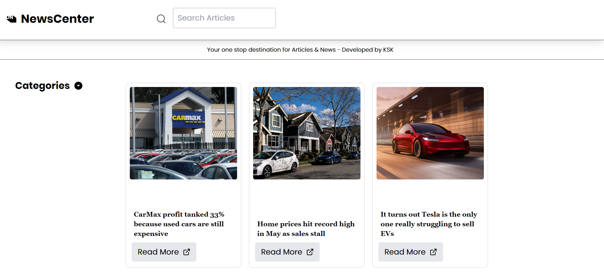
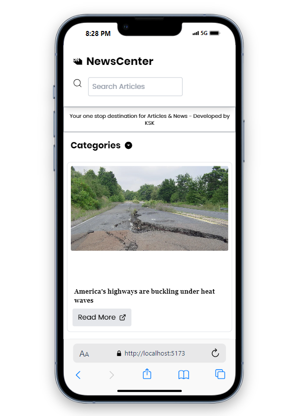
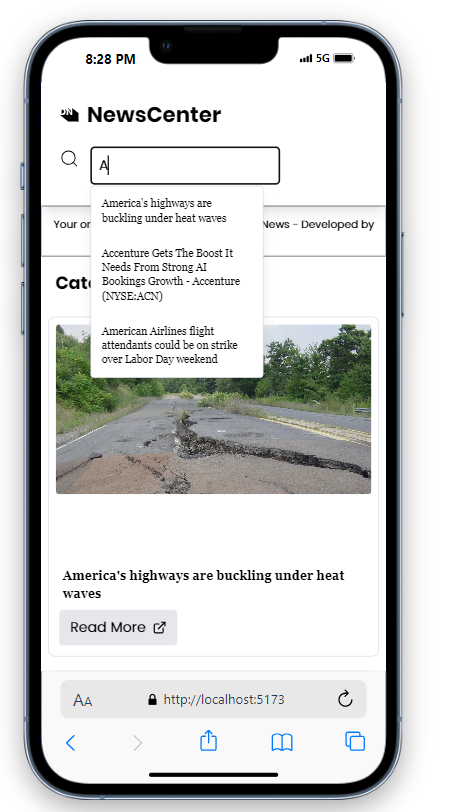

# News Application
# Imp Note
- *** Since the API's are rate-limited and monetized, please open the website quite a few times else you may not see the responses when you reach a specific limit.

## Libraries used/ Tech-stack
- Reactjs library for frontend ⚛️
- Redux-toolkit for global state management ⚛️
- JavaScript 🧑‍💻
- Vite bundler⚡

## Additional/ Secondary libraries and frameworks used
- Tailwind CSS 💨 (visit the official docs: `https://tailwindcss.com/`)

## API's used for data (rate-limited for free-tier)
- 📎📎 The News api: https://www.thenewsapi.com/documentation

## Features
- Category based filtering
- Search feature (along with suggestions)
- Pagination 

## Snaps of the Project
- 
- 
- 

## Local Setup
- clone using `git clone <git url>`
- cd into the folder `NewsApp`
- install the required dependencies using `npm install`
- start locally using the command `npm run dev`
